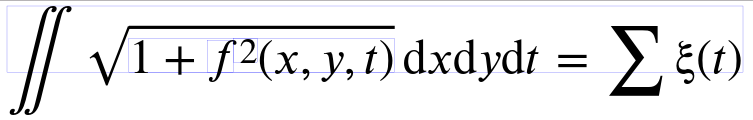
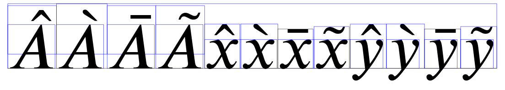
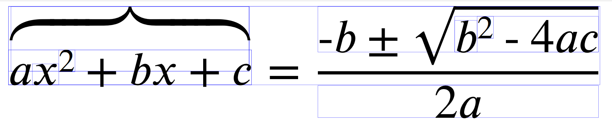
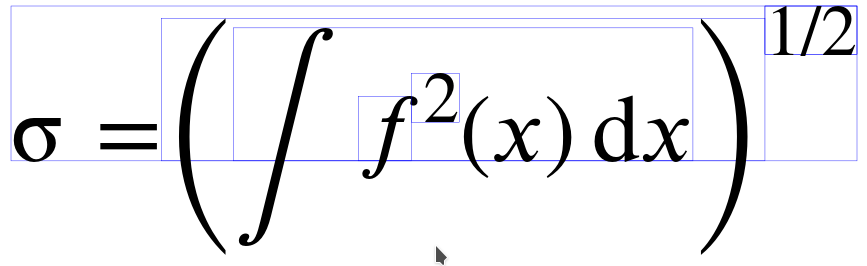
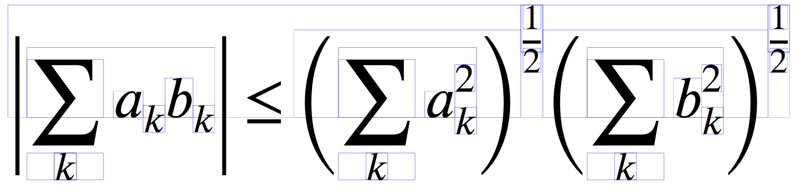
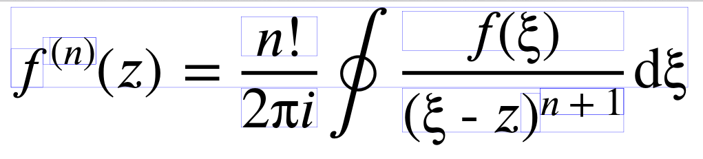
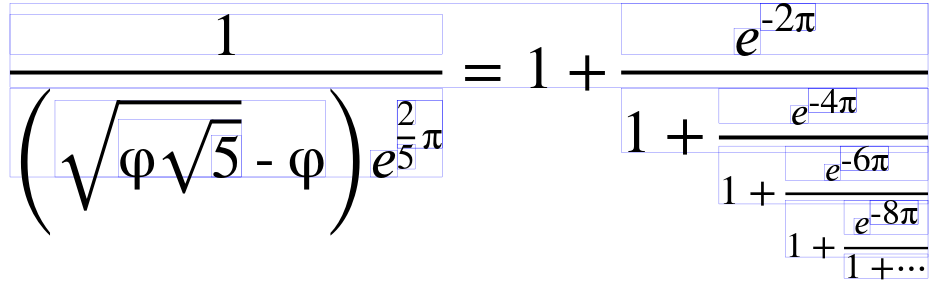
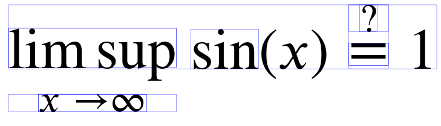

# ReX
Typesetting mathematics.

# Progress

Extendable glyphs (integral, sqrt): `\Vert f \Vert_2 = \sqrt{\int f^2(x)\,\mathrm{d}x}`

Scripts: `x^{x^{x^x_x}_{x^x_x}}_{x^{x^x_x}_{x^x_x}}`

Todo: Add horizontal kerning to scripts (test `P_n`).

Accents: '\hat A\grave A\bar A\tilde A\hat x \grave x\bar x\tilde x\hat y\grave y\bar y\tilde y'

Todo: Compensate for overshot from accents (see kerning)?

`\left` and `\right`: `\sigma = \left(\int f^2(x)\,\mathrm{d}x\right)^{1/2}`

Fractions: `f^{(n)}(z) = \frac{n!}{2\pi i} \oint \frac{f(\xi)}{(\xi - z)^{n+1}}\,\mathrm{d}\xi`

TODO: There seems to be a few inconsistencies with some fonts and the standard...

`\frac{1}{\left(\sqrt{\phi\sqrt5} - \phi\right) e^{\frac{2}{5}\pi}} = 1 + \frac{e^{-2\pi}}{1 + \frac{e^{-4\pi}}{1 + \frac{e^{-6\pi}}{1 + \frac{e^{-8\pi}}{1 + \unicodecdots}}}}`

Atom commands [`\mathop`, `\mathrel`, `\mathord`]: `\mathop{\mathrm{lim\,sup}}\limits_{x\rightarrow\infty}\ \mathop{\mathrm{sin}}(x)\mathrel{\mathop{=}\limits^?}1`

